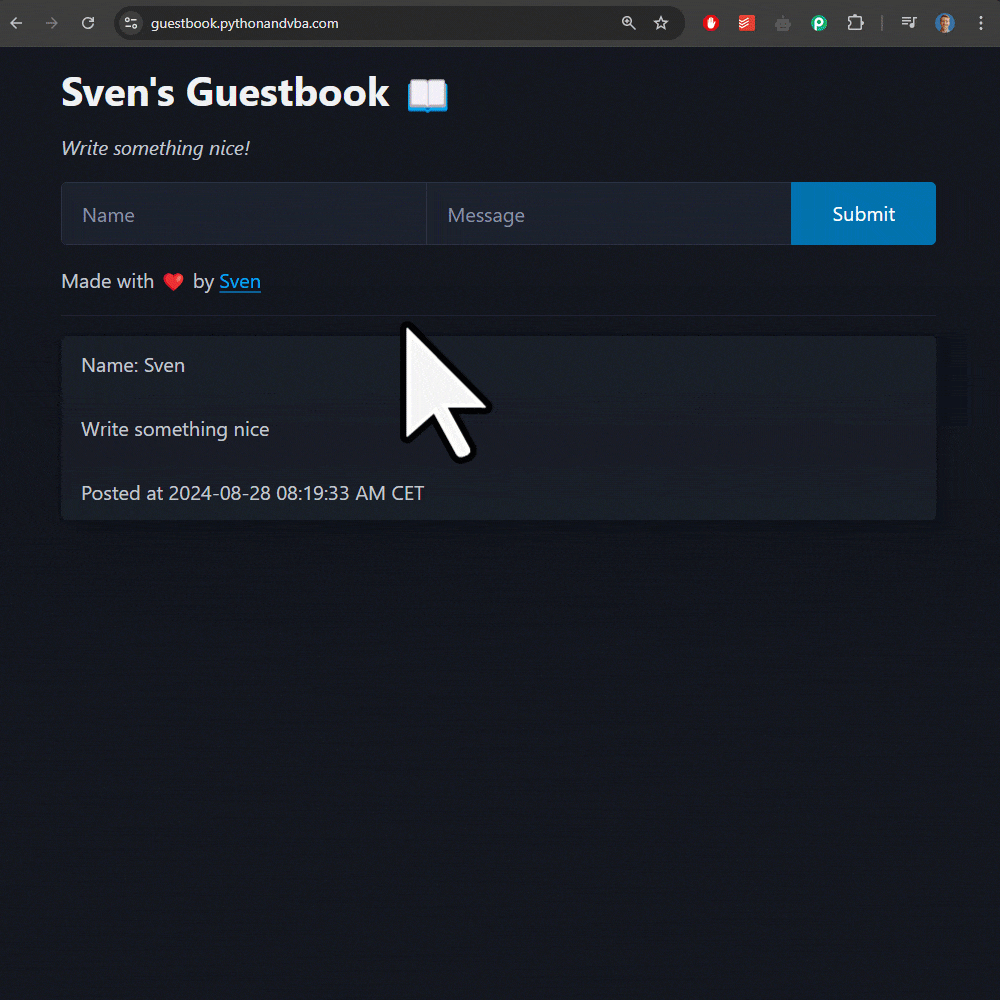

# Sven's Guestbook

A simple, real-time guestbook application built with:

- [FastHTML](https://fastht.ml): A Python framework for building HTML applications
- [HTMX](https://htmx.org): For seamless AJAX requests and updates

👋 Say hi: [https://guestbook.pythonandvba.com](https://guestbook.pythonandvba.com)



## Inspiration

This project was inspired by [Matt's Guestbook](https://github.com/mattppal/fasthtml-guestbook/tree/main). Thanks, Matt! 🙏

## Video Tutorial (Coming soon!)
[](https://youtu.be/XXX)

## Setup

### Prerequisites

To set up the guestbook, you'll need:

- **Python 3.x** installed on your system.
- **Google Sheets API** and **Google Drive API** enabled on your Google account.
- **Credentials JSON File:** A `credentials.json` file is required to authenticate with the Google Sheets API. If you haven't set this up yet, a quick tutorial will be provided to guide you through the process.

### Installation

1. **Clone the Repository:**

   ```bash
   git clone https://github.com/Sven-Bo/fasthtml-guestbook.git
   cd yourrepository
   ```
2. **Install Dependencies:**

   Install the required Python packages using `pip`:

   ```bash
   pip install -r requirements.txt
   ```

3. **Set Up Google Sheets API:**

   - Enable the Google Sheets API and Google Drive API in your Google Cloud Console.
   - Download the `credentials.json` file and place it in the root directory of your project.
   - Share your Google Sheets document with the email address listed in the `credentials.json` file.

4. **Run the Application:**

   Start the server by running:

   ```bash
   python main.py
   ```

   Visit `http://localhost:5001` in your browser to see the guestbook in action.

## Deployment

You can deploy this guestbook application using your preferred hosting service. Follow the steps in the [FastHTML documentation](https://docs.fastht.ml/tutorials/by_example.html#deploying-your-app) to learn how to deploy your application.


## 🤝 Connect with Me
- 📺 **YouTube:** [CodingIsFun](https://youtube.com/c/CodingIsFun)
- 🌐 **Website:** [PythonAndVBA](https://pythonandvba.com)
- 💬 **Discord:** [Join the Community](https://pythonandvba.com/discord)
- 💼 **LinkedIn:** [Sven Bosau](https://www.linkedin.com/in/sven-bosau/)
- 📸 **Instagram:** [sven_bosau](https://www.instagram.com/sven_bosau/)

## Support 
If you appreciate the project and wish to encourage its continued development, consider [supporting my work](https://pythonandvba.com/coffee-donation).
[](https://pythonandvba.com/coffee-donation)

## Feedback & Collaboration
For feedback, suggestions, or potential collaboration opportunities, reach out at contact@pythonandvba.com.

